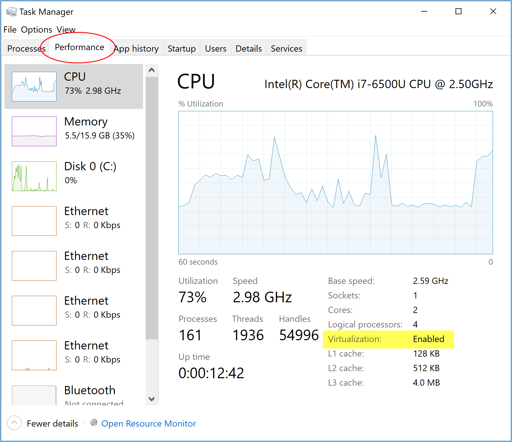

# [Installing Docker on Windows 10](https://youtu.be/lIkxbE_We1I)

* First make sure Windows is up-to-date.
  * In the Windows search type "Windows Update" and select `Windows Update setting`
  * You should see a green check and “You’re up to date”.  If not click “Check for updates”.  You will
    need to **repeat this process until you no longer have any updates to install**.
* BIOS-level hardware virtualization support must be enabled in the BIOS settings.
  * Open Task Manager, click "more details", and go to the prormance tab.
  * If you don't see "Virtualization: Enabled" then you'll need to turn on Virtualization in your Bios. 

* Next install [WSL2](https://docs.microsoft.com/en-us/windows/wsl/install-win10)
  * From the Windows Search Type "powershell" then right-click on `Windows PowerShell` and then `Run as administrator`.
  * Click `Yes' to allow PowerShell to make changes to your device.
  * In the Administrator: Windows PowerShell window run (copy and past) "wsl --install -d Ubuntu" to install Windows Subsystem for Linux (wsl).
  * You will then need to restart your computer.
  * When it restarts Ubuntu will be installing. 
  * Once it's done you will be asked to set up a Linux user.  I recommend the same username you use for Windows.
  * You will now be able to run Linux commands in the Ubuntu terminal window. 
  * Next enable the Virtual Machine Platform.  In the Administrator: Windows PowerShell run (copy and past)
    "dism.exe /online /enable-feature /featurename:VirtualMachinePlatform /all /norestart".
  * Download and install the [WSL2 Linux kernel update package for x64 machines](https://wslstorestorage.blob.core.windows.net/wslblob/wsl_update_x64.msi)
  * Reboot Windows.
  * Again from the Windows Search Type "powershell" then right-click on `Windows PowerShell` and then
    `Run as administrator`.
  * In the PowerShell window run "wsl --set-default-version 2".
* Now you can install [Docker Desktop for Windows](https://docs.docker.com/docker-for-windows/install/)
  * Download the Docker Desktop for Windows installer from
    [https://www.docker.com/products/docker-desktop](https://www.docker.com/products/docker-desktop)
  * Run the installer.
  * Reboot Windows.
  * Login to Windows and let Docker finish setting up.  This can take a few minutes depending on your machine.
* Run the docker “Hello World” from an Ubuntu Terminal run "docker run hello-world".
* Run the docker “Hello World” from a Windows PowerShell run "docker run hello-world".
* You have now installed Docker on Windows 10 for local workstation development.

pulled from [Installing Docker on Windows 10](https://github.com/jstormes/php-docker-compose/blob/main/Documentation/01a_InstallingDockerOnWindows.md)
